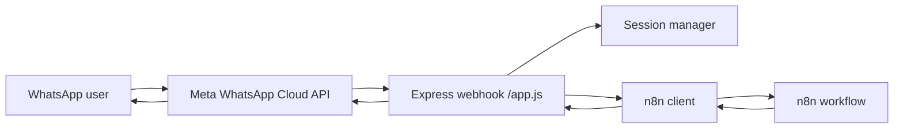

# Tara AI

Tara AI is a WhatsApp assistant that receives a user's message, keeps the conversation history, sends the request to an n8n workflow, and returns the workflow response back to WhatsApp.

It is designed to reduce the friction of asking for educational guidance by turning a complex process into a simple chat.

## Overview

Tara acts as a thin orchestration layer between WhatsApp and n8n. The bot does not store a knowledge base in code and does not try to answer educational questions on its own. Instead, it forwards each user message to n8n together with the chat history, then sends the generated reply back to WhatsApp.

This keeps the backend lightweight and makes the AI behavior easy to change inside the n8n workflow.

## What it does

- Receives incoming WhatsApp messages through Meta's webhook.
- Verifies the webhook using the configured `VERIFY_TOKEN`.
- Stores conversation history in memory per phone number.
- Sends the current message and conversation history to n8n.
- Returns the reply generated by the n8n workflow to the user.
- Sends a short temporary error message if the workflow fails.

## How it works

1. A user sends a WhatsApp message.
2. Meta forwards the event to the webhook exposed by this app.
3. The server verifies the webhook challenge on `GET /webhook`.
4. On `POST /webhook`, the message is extracted and processed.
5. The bot sends `question + history + sessionId` to n8n.
6. The reply from n8n is sent back to the user on WhatsApp.

## Architecture



## Main components

- `app.js`: Express server, webhook verification, WhatsApp event handling.
- `src/conversationFlow.js`: Session handling, greeting, history management, and response flow.
- `src/n8nClient.js`: HTTP client that calls the n8n webhook and normalizes the response.
- `src/whatsappClient.js`: Parses incoming WhatsApp payloads and sends replies through the Meta Graph API.
- `src/sessionManager.js`: In-memory session store keyed by phone number.

## Message flow

The bot keeps the conversation open so the user can continue asking follow-up questions.

Typical messages can be like:

- "I am 18 and I live in Boyacá. What options do I have?"
- "I cannot afford private university. What free programs are available?"
- "What documents do I need to apply?"
- "I already have an ICFES score. What can I do with it?"

## n8n contract

The bot sends a minimal payload to n8n:

- `question`: the current user message.
- `history`: the conversation history mapped to user/assistant roles.
- `sessionId`: the phone number used as the conversation identifier.

The response from n8n should contain plain text in one of the common fields handled by the client (`text`, `result`, `output`, `answer`, `message`, `response`, or nested variants).

## Environment variables

The app uses these variables in Render or local development:

- `VERIFY_TOKEN`: token used to validate the Meta webhook challenge.
- `N8N_WEBHOOK_URL`: full webhook URL exposed by n8n.
- `N8N_API_KEY`: optional bearer token if the n8n webhook is protected.
- `N8N_TIMEOUT_MS`: request timeout in milliseconds.
- `WHATSAPP_TOKEN`: Meta WhatsApp Cloud API token.
- `WHATSAPP_PHONE_ID`: WhatsApp Business phone number ID.
- `PORT`: HTTP port used by the Express server.

## Local setup

```bash
npm install
cp .env.example .env
npm run dev
```

## Testing

```bash
npm run smoke
npm run smoke:conversation
```

These smoke tests cover the n8n client normalization and the conversation flow from WhatsApp message to workflow response.

## Deploying on Render

1. Create a new Web Service on Render.
2. Connect the repository.
3. Set the environment variables listed above.
4. Use `npm start` as the start command.
5. Configure Meta's webhook callback to point to `/webhook` on the Render URL.

## Current status

The bot is connected to WhatsApp and ready to receive and reply to real messages.

## Troubleshooting

- If webhook verification fails, check `VERIFY_TOKEN` and the callback URL.
- If the bot receives messages but does not reply, check `WHATSAPP_TOKEN` and `WHATSAPP_PHONE_ID`.
- If the workflow response is empty, check the n8n webhook output shape and timeout.
- If the workflow is slow, increase `N8N_TIMEOUT_MS`.

## Notes

- No educational knowledge base is stored in the codebase.
- The AI behavior is expected to be handled inside the n8n workflow.
- Conversation history is kept in memory only.
